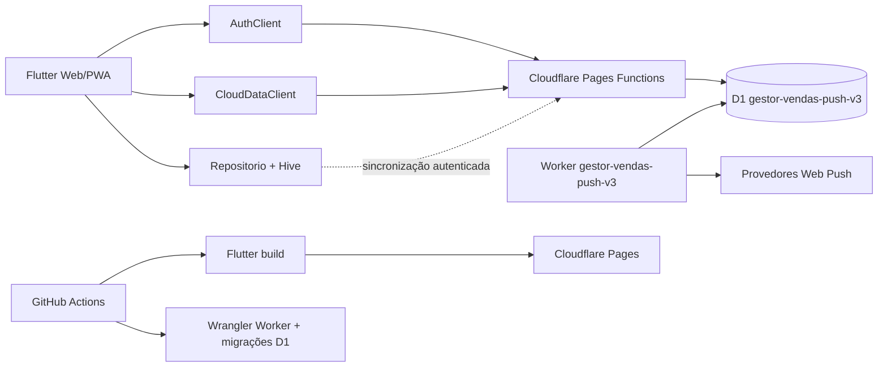

# Gestor de Vendas

Aplicação **Flutter Web/PWA** para gestão de vendas, portabilidades, prospecções, clientes, metas, campanhas e notificações de acompanhamento. O sistema foi projetado para uso multiusuário por equipes autorizadas, com isolamento de dados por usuário, autenticação própria, sincronização com Cloudflare D1 e publicação automatizada pelo GitHub Actions.

> **Objetivo deste README:** permitir que uma pessoa nova entenda o projeto e consiga executar, validar e publicar uma alteração sem depender do histórico de conversas. A documentação descreve o estado da branch `main` em agosto de 2026.

## Acesso e repositório

| Recurso | Endereço ou identificador |
|---|---|
| Repositório | [jralmeida-gif/Gerenciador-de-vendas](https://github.com/jralmeida-gif/Gerenciador-de-vendas) |
| Aplicação em produção | [gestor-vendas-agencia-v3.pages.dev](https://gestor-vendas-agencia-v3.pages.dev/) |
| Projeto Pages | `gestor-vendas-agencia-v3` |
| Worker de notificações | `gestor-vendas-push-v3` |
| Banco D1 | `gestor-vendas-push-v3` |
| Arquivo do workflow | `.github/workflows/ci-cd-v3.yml` |

Os identificadores acima são referências operacionais, não credenciais. **Tokens, chaves privadas e senhas nunca devem ser incluídos no repositório.**

## Início rápido

### Pré-requisitos

Para executar o PWA localmente, instale o **Flutter 3.47.0** no canal stable, com suporte web habilitado, além de um navegador compatível. O SDK Dart precisa atender ao requisito declarado em `pubspec.yaml` (`^3.9.2`). A documentação oficial do Flutter descreve a configuração de projetos web, execução no navegador e geração do build de produção [1].

Para trabalhar no Worker e nas Pages Functions, instale **Node.js 22**, `npm` e o Wrangler. O pacote do Worker mantém as dependências em `push_worker/package.json`.

### Executar o Flutter localmente

No diretório raiz do projeto:

```bash
flutter pub get
flutter run -d chrome
```

O comando abre uma versão local do PWA no Chrome. Para produzir os arquivos estáticos de release:

```bash
flutter build web --release
```

O resultado é gravado em `build/web`. Os arquivos dessa pasta precisam ser servidos juntos; não se deve publicar apenas `main.dart.js` ou apenas a pasta `assets` [1].

### Validar o projeto

Execute, na raiz:

```bash
flutter analyze
flutter test
flutter build web --release
```

Depois valide o Worker:

```bash
cd push_worker
npm install
npx tsc --noEmit --skipLibCheck
```

A análise do Flutter deve terminar com `No issues found!` e os testes devem terminar com `All tests passed!`. O workflow oficial repete essas verificações antes de qualquer publicação.

### Validar também as Pages Functions

O código das Functions fica em `functions/`. Para uma validação local estrita de todos os arquivos TypeScript, use:

```bash
cd push_worker
npx tsc --noEmit \
  --target ES2022 \
  --module ESNext \
  --moduleResolution Bundler \
  --strict \
  --skipLibCheck \
  --types @cloudflare/workers-types \
  $(find ../functions -name '*.ts' -print)
```

Esse comando complementa o `tsconfig.json` do Worker, que tem como entrada principal `push_worker/src/**/*.ts`.

## O que o sistema faz

O aplicativo possui cinco áreas principais na navegação inferior: **Painel**, **Vendas**, **Portabilidade**, **Prospecção** e **Relatórios**. O cabeçalho oferece atalhos globais para **Agenda**, **Clientes**, **Ajuda** e **Configurações**. Formulários e telas de detalhe devem sempre manter uma rota de retorno ou o menu inferior; uma tela nova não pode deixar o usuário preso.

O cadastro de um CPF conhecido pode preencher automaticamente nome, telefone e data de nascimento nos formulários de venda, portabilidade e prospecção. A conversão de uma prospecção em venda conclui automaticamente a prospecção de origem somente depois que a venda é salva com sucesso.

O catálogo de produtos e convênios é administrado globalmente. Alterações feitas por um administrador são propagadas aos espelhos de usuários; produtos excluídos permanecem preservados como inativos para não alterar o histórico de operações antigas.

## Arquitetura resumida



A explicação completa dos fluxos, tabelas, rotas e fronteiras de responsabilidade está em [`docs/ARQUITETURA.md`](docs/ARQUITETURA.md).

## Dados e isolamento

O aplicativo combina persistência local e nuvem. O Hive mantém os dados do perfil no dispositivo para permitir a continuidade da operação e melhorar a experiência; o Cloudflare D1 mantém a cópia sincronizada do servidor. O sistema **não deve ser tratado como um banco exclusivamente offline**: a sincronização é parte da arquitetura e deve ser considerada em qualquer alteração de dados.

A API comum lê e grava as entidades de negócio usando o `user_id` da sessão autenticada. Nenhuma função nova deve aceitar um `user_id` fornecido livremente pelo navegador quando ele puder ser obtido da sessão. Catálogo mestre, autenticação, sessões e notificações possuem regras próprias e não devem ser misturados ao snapshot comum do usuário.

As tabelas e as regras de isolamento estão documentadas em [`docs/ARQUITETURA.md`](docs/ARQUITETURA.md). As operações sensíveis estão em [`docs/OPERACAO-E-SEGURANCA.md`](docs/OPERACAO-E-SEGURANCA.md).

## Autenticação e segurança

A autenticação é implementada nas Pages Functions. As senhas são protegidas com **PBKDF2-SHA-256**, com salt individual e 100.000 iterações. A sessão utiliza um cookie `gv_session` com `HttpOnly`, `Secure`, `SameSite=Lax` e validade de 14 dias no servidor.

A aplicação também possui logout manual, logout automático por inatividade configurável, persistência do último momento de atividade por perfil e verificação da sessão ao reabrir o PWA. O temporizador é uma defesa de sessão no cliente; ele não substitui a expiração e a validação do cookie no servidor.

A recuperação de senha usa e-mail via Mailjet. O link é de uso único e expira conforme a regra da Function. A senha mestra da limpeza global, quando configurada, deve existir somente como segredo do ambiente de produção da Pages.

> **Regra de segurança:** nunca faça commit de senhas, tokens Cloudflare, chaves VAPID, chaves Mailjet, cookies ou dados reais de clientes.

## CI/CD e publicação

O workflow [`ci-cd-v3.yml`](.github/workflows/ci-cd-v3.yml) é executado em pull requests para `main`, em pushes para `main` e manualmente por `workflow_dispatch`. A publicação só ocorre depois da validação.

| Etapa | Responsabilidade |
|---|---|
| `Validar Flutter e Worker` | Instala Flutter, executa análise, testes, build web e verificação TypeScript. |
| `Publicar v3 no Cloudflare` | Aplica migrações D1 quando o commit altera `push_worker/migrations/`, publica o Worker e faz upload de `build/web` para Pages. |
| Ambiente GitHub | O job de deploy usa o ambiente `production`. |

Cloudflare Pages permite publicar artefatos previamente construídos por upload direto com Wrangler, o que combina com o build Flutter e o pipeline atual [2]. As migrações D1 são arquivos SQL versionados, aplicados em ordem pelo Wrangler e registrados pelo próprio D1 [3].

Para detalhes de secrets, permissões e recuperação de falhas, consulte [`CONTRIBUTING.md`](CONTRIBUTING.md) e [`docs/OPERACAO-E-SEGURANCA.md`](docs/OPERACAO-E-SEGURANCA.md).

## Processo normal para alterar o app

A sequência recomendada é:

1. Criar uma branch a partir de `main`.
2. Entender o fluxo da funcionalidade e localizar o serviço ou tela responsável.
3. Implementar a alteração preservando isolamento, navegação e compatibilidade com dados existentes.
4. Executar `flutter analyze`, `flutter test`, `flutter build web --release` e a validação TypeScript.
5. Abrir um pull request para `main` com descrição do problema, solução, riscos e testes executados.
6. Aguardar o workflow verde e a revisão de outro colaborador.
7. Fazer merge somente depois da revisão.
8. Acompanhar o deploy em **Actions** e verificar a aplicação em produção.

Não edite diretamente o banco de produção para corrigir uma funcionalidade sem registrar a decisão e sem avaliar migração, backup e reversibilidade.

## Documentação do repositório

| Documento | Para que serve |
|---|---|
| [`docs/GUIA-INTEGRACAO.md`](docs/GUIA-INTEGRACAO.md) | Roteiro completo do primeiro dia de um colaborador. |
| [`docs/ARQUITETURA.md`](docs/ARQUITETURA.md) | Componentes, fluxo de dados, autenticação, tabelas e rotas. |
| [`docs/OPERACAO-E-SEGURANCA.md`](docs/OPERACAO-E-SEGURANCA.md) | Secrets, backups, push, recuperação de senha, limpeza e incidentes. |
| [`CONTRIBUTING.md`](CONTRIBUTING.md) | Branches, commits, PRs, validação e publicação. |
| [`push_worker/migrations/`](push_worker/migrations/) | Histórico versionado do schema D1. |
| [`.github/workflows/ci-cd-v3.yml`](.github/workflows/ci-cd-v3.yml) | Fonte oficial do pipeline de CI/CD. |

## Referências oficiais

[1]: https://docs.flutter.dev/platform-integration/web/building "Flutter — Building a web application"

[2]: https://developers.cloudflare.com/pages/how-to/use-direct-upload-with-continuous-integration/ "Cloudflare Pages — Use Direct Upload with continuous integration"

[3]: https://developers.cloudflare.com/d1/reference/migrations/ "Cloudflare D1 — Migrations"

[4]: https://docs.github.com/actions/using-workflows/workflow-syntax-for-github-actions "GitHub — Workflow syntax for GitHub Actions"

[5]: https://developers.cloudflare.com/workers/configuration/cron-triggers/ "Cloudflare Workers — Cron Triggers"
