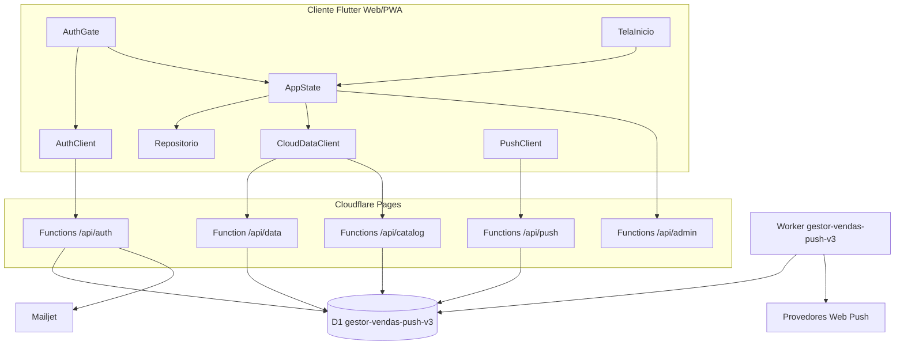

# Arquitetura do Gestor de Vendas

## Visão geral

O Gestor de Vendas é um aplicativo Flutter compilado para web e instalado como PWA em navegadores de desktop e dispositivos móveis. A arquitetura combina armazenamento local para continuidade de uso com sincronização autenticada em Cloudflare Pages Functions e D1.

A decisão central do projeto é separar **identidade**, **dados de negócio por usuário**, **catálogo global** e **estado técnico de notificações**. Essa separação evita que a operação de um usuário altere dados de outro e permite que o administrador mantenha produtos e convênios de forma centralizada.

## Diagrama de componentes



## Camada Flutter

`lib/main.dart` inicializa o Hive, cria o `AppState` via Provider e monta o `AuthGate` como entrada da aplicação. O `AuthGate` decide se deve mostrar carregamento, recuperação de senha, login, troca obrigatória de senha ou o shell autenticado.

`lib/screens/inicio.dart` é o shell da aplicação. Ele mantém cinco áreas em uma navegação inferior e abre telas globais, como Agenda, Clientes, Ajuda e Configurações, por callbacks controlados pelo estado. `lib/widgets/comuns.dart` concentra o cabeçalho, atalhos, cards, campos de senha e componentes compartilhados.

`lib/services/app_state.dart` é o coordenador do estado de domínio. Ele expõe listas e configurações para a interface, chama o repositório local, aciona a sincronização e mantém o catálogo ativo/inativo. A interface deve preferir os métodos do `AppState` em vez de alterar caixas Hive diretamente.

`lib/services/repositorio.dart` encapsula o Hive. Cada perfil usa nomes namespaced no formato aproximado `gv_<perfil>_<caixa>`. A caixa `gv_profile_registry` registra o vínculo entre o ID imutável do usuário e o nome sanitizado do perfil local, permitindo invalidar caches de usuários removidos durante uma limpeza global.

## Fluxo de abertura e sessão

O fluxo de abertura é intencionalmente defensivo:

```text
1. Inicializa Hive e abre o perfil guest.
2. AuthGate consulta /api/auth/session.
3. Se houver sessão, troca para o perfil do usuário e registra o ID local.
4. Confere o último momento de atividade persistido.
5. Se o limite foi ultrapassado, limpa a sessão e mostra o login sem montar TelaInicio.
6. Caso contrário, carrega dados e catálogo da nuvem.
7. Se não houver sessão, reconcilia eventual marca global de limpeza sem exigir login.
8. Monta somente a tela correspondente ao estado autenticado.
```

A sessão remota é armazenada em cookie `gv_session`. O servidor calcula o hash do token antes de consultar a tabela `sessions`; o token em claro não é armazenado no D1. O cookie possui `HttpOnly`, `Secure`, `SameSite=Lax`, caminho `/` e validade de 14 dias. A senha é derivada com PBKDF2-SHA-256, salt individual e 100.000 iterações em `functions/_auth.ts`.

O logout manual troca a interface para a tela de login antes de aguardar operações assíncronas, encerra o perfil local e invalida o cookie no servidor em uma operação de melhor esforço. O logout automático usa `SessionGuard`, eventos de ciclo de vida do navegador, eventos de atividade e o timestamp persistido no Hive. O timestamp não pertence ao backup de negócio.

## Sincronização de dados

`CloudDataClient.load()` chama `GET /api/data` com credenciais do navegador. `CloudDataClient.save()` envia um snapshot JSON para `POST /api/data`. A API identifica o usuário pelo cookie e usa o ID obtido da sessão em todas as consultas e operações de gravação.

O `GET /api/data` devolve a configuração do usuário, produtos e convênios disponíveis, metas, metas mensais, campanhas, vendas, portabilidades, prospecções, clientes e a marca de limpeza global, quando existir. O `POST /api/data` regrava o snapshot das entidades de negócio do usuário, atualiza configurações e não permite que o fluxo comum altere o catálogo mestre.

A sincronização pode ser entendida como um snapshot do perfil autenticado, não como uma fila de eventos. Por isso, qualquer nova entidade deve ser incluída de forma consistente em leitura, gravação, importação de backup e limpeza.

## Organização do D1

As migrações estão em `push_worker/migrations/` e devem ser aplicadas em ordem. A tabela de migrações é controlada pelo D1/Wrangler, conforme o mecanismo oficial de migrations [1].

### Identidade e infraestrutura

| Tabela | Escopo | Uso |
|---|---|---|
| `users` | Global | Identidades, papel `admin`/`user`, senha derivada, status e alias. |
| `sessions` | Por usuário | Hashes de sessões e expiração. |
| `user_settings` | Por usuário | Avatar, alias, tempo de inatividade, e-mail de recuperação e preferências. |
| `app_settings` | Global | Flags do sistema, bootstrap e marca global de limpeza. |
| `password_reset_tokens` | Por usuário | Tokens temporários de recuperação de senha. |

### Dados de negócio isolados

| Tabela | Escopo | Conteúdo |
|---|---|---|
| `user_sales` | `user_id` | Vendas registradas. |
| `user_portabilidades` | `user_id` | Portabilidades e confirmação. |
| `user_prospeccoes` | `user_id` | Prospecções e conclusão. |
| `user_clients` | `user_id` | Ficha consolidada de clientes, inclusive prospectados. |
| `user_metas` | `user_id` | Metas por produto. |
| `user_monthly_metas` | `user_id` | Metas mensais. |
| `user_campaigns` | `user_id` | Campanhas e alvos por produto. |

### Catálogo global e espelhos

| Tabela | Escopo | Conteúdo |
|---|---|---|
| `catalog_products` | Global | Produtos mestres, formato e estado `active`. |
| `catalog_convenios` | Global | Convênios mestres e código. |
| `user_products` | Espelho por usuário | Catálogo recebido pelo perfil, incluindo estado ativo/inativo. |
| `user_convenios` | Espelho por usuário | Convênios disponíveis para o perfil. |

Produtos excluídos são tratados como inativos no catálogo para preservar o histórico. Uma renomeação de produto deve atualizar históricos, metas e alvos de campanha conforme a regra de `functions/api/admin/catalog.ts`; uma exclusão não deve apagar o texto histórico da venda.

### Notificações e tabelas legadas

| Tabela | Escopo | Conteúdo |
|---|---|---|
| `push_subscriptions` | `user_id` | Assinaturas Web Push por dispositivo. |
| `notifications_sent` | `user_id` | Chaves de deduplicação de alertas já enviados. |
| `notifications_attempts` | `user_id` | Tentativas, status HTTP e erro do provedor. |
| `portabilidades` | `user_id` | Fonte legada usada pelo Worker para portabilidades pendentes. |
| `prospeccoes` | `user_id` | Fonte legada usada pelo Worker para retornos de prospecção. |

As tabelas legadas de `portabilidades` e `prospeccoes` não devem ser esquecidas em uma alteração de sincronização ou limpeza. Elas continuam sendo fontes de dados para a agenda de notificações.

## API e fronteiras de autorização

| Rota | Método(s) | Regra |
|---|---|---|
| `/api/auth/status` | GET | Indica se o bootstrap inicial é necessário. |
| `/api/auth/register-first` | POST | Cria o primeiro administrador. |
| `/api/auth/login` | POST | Valida identificador e senha e cria sessão. |
| `/api/auth/session` | GET | Retorna o usuário da sessão atual. |
| `/api/auth/logout` | POST | Remove a sessão atual e limpa o cookie. |
| `/api/auth/change-password` | POST | Troca a senha do usuário autenticado. |
| `/api/auth/verify-password` | POST | Valida a senha atual sem alterá-la. |
| `/api/auth/request-reset` | POST | Inicia recuperação por e-mail. |
| `/api/auth/reset-password` | POST | Consome token e grava nova senha. |
| `/api/auth/users` | GET/POST/PATCH/DELETE | Administração de usuários; exige `admin`. |
| `/api/data` | GET/POST | Snapshot de dados do usuário autenticado. |
| `/api/catalog` | GET | Catálogo para sessão válida. |
| `/api/admin/catalog` | GET/POST | Administração do catálogo; exige `admin`. |
| `/api/admin/global-cleanup` | POST | Limpeza global; exige admin, senha atual e senha mestra. |
| `/api/cleanup-status` | GET | Marca não sensível para reconciliação local antes do login. |
| `/api/push/config` | GET | Chave pública VAPID. |
| `/api/push/subscribe` | POST/DELETE | Cria ou remove assinatura do usuário atual. |
| `/api/push/records` | POST | Sincroniza fontes de lembretes do usuário. |

Uma Pages Function deve usar `getSession(request, env)` e, em rotas administrativas, confirmar `isAdmin`. O cliente não deve conseguir substituir o `user_id` efetivo com um campo arbitrário do JSON.

## Notificações push

O Worker `gestor-vendas-push-v3` é definido em `push_worker/wrangler-v3.toml` e usa o binding D1 `DB`. O cron é `0 * * * *`, portanto a execução é horária em UTC; o código converte a data para `America/Sao_Paulo` antes de decidir os horários de negócio. A documentação oficial do Cloudflare confirma que Cron Triggers executam um handler `scheduled()` e usam horário UTC [2].

Os alertas implementados são:

- aniversário do cliente no dia correspondente, nos slots de 9h e 14h;
- portabilidade pendente em ciclos de cinco dias, no slot das 9h;
- retorno de prospecção no dia anterior às 9h, no dia do retorno às 9h e no dia do retorno às 14h.

Cada envio usa uma chave de deduplicação por usuário. Tentativas são registradas com o status do provedor; endpoints Web Push que retornam 404 ou 410 são removidos.

## Limpeza individual e global

A limpeza individual é local ao perfil ativo e, quando sincronizada, afeta somente as linhas daquele `user_id`. A opção individual “Apagar TUDO” também permanece limitada ao perfil conectado.

A limpeza global está em `functions/api/admin/global-cleanup.ts` e é exibida somente para administradores. Ela sempre inclui dados de negócio; o administrador pode selecionar o catálogo e os dados de usuários comuns. A operação preserva contas administrativas e a estrutura da base. A senha mestra é lida de `GLOBAL_CLEANUP_MASTER_PASSWORD`, configurada como secret do ambiente Pages, nunca como valor do código.

Após a exclusão, a Function grava `global_cleanup_marker` em `app_settings`. O marcador inclui a versão da operação, as categorias selecionadas e os IDs dos usuários removidos. O Flutter usa essa marca para limpar caixas locais do administrador e os perfis removidos que já foram registrados no dispositivo.

## Navegação e telas

A navegação inferior contém cinco áreas fixas e não deve ser duplicada por cada tela. Telas globais entram pelo shell ou recebem um retorno claro. Formulários abertos sobre o shell precisam avaliar se devem exibir `MenuRodapeApp` e `mostrarVoltar: true`.

O cabeçalho compartilhado deve conservar a identidade do app, o alias, a foto de perfil e os atalhos de Agenda, Clientes, Ajuda e Configurações. Qualquer alteração no cabeçalho deve ser testada em telas principais, telas auxiliares e telas de detalhe.

## Regras de manutenção arquitetural

Uma mudança de domínio deve ser rastreada do formulário ao banco. Uma mudança de autenticação deve ser validada tanto na interface quanto no servidor. Uma mudança de tabela deve vir com migração. Uma mudança de notificação deve considerar cron, timezone, deduplicação, tentativas e assinaturas antigas.

Quando a semântica de um dado não estiver clara, não escolha a tabela pelo nome mais conveniente. Confirme se o dado é identidade, configuração, negócio por usuário, catálogo global ou estado técnico. Essa decisão é mais importante do que a quantidade de arquivos alterados.

## Referências

[1]: https://developers.cloudflare.com/d1/reference/migrations/ "Cloudflare D1 — Migrations"

[2]: https://developers.cloudflare.com/workers/configuration/cron-triggers/ "Cloudflare Workers — Cron Triggers"
